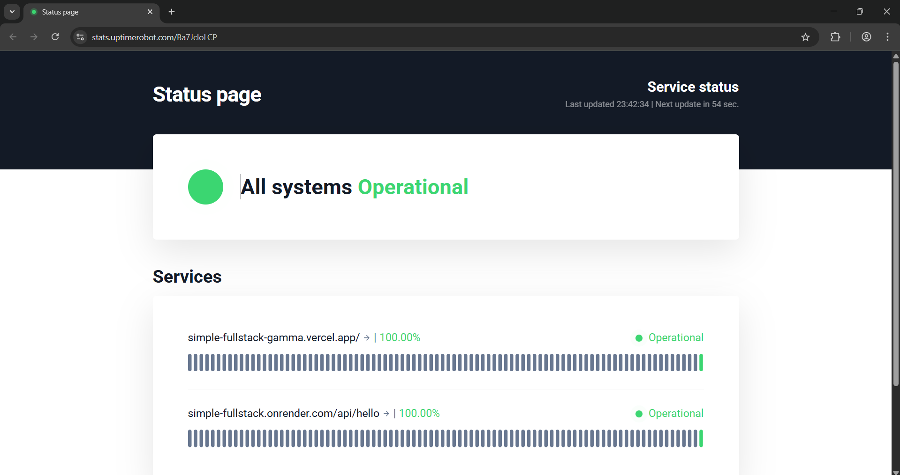
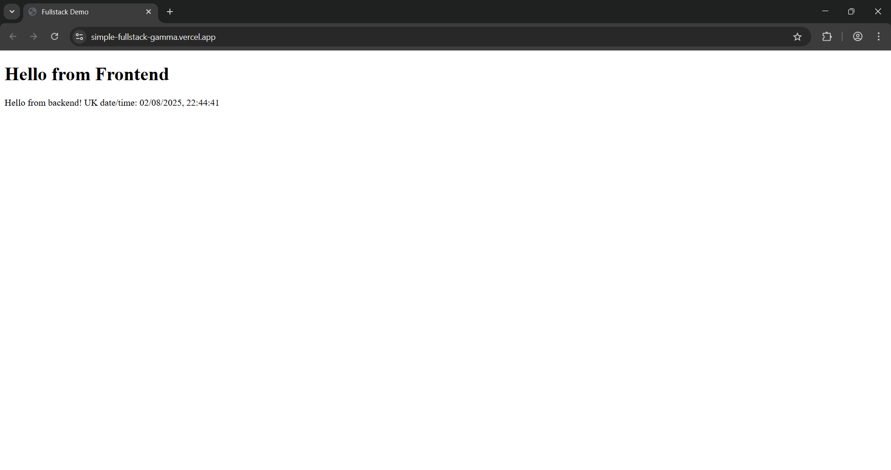

# Simple Fullstack Project

Welcome to **Simple Fullstack**!  
This project demonstrates a modern fullstack setup with a React frontend and a Node.js/Express backend.

---

## 🚀 Live Demo

- **Frontend:**  
  [https://simple-fullstack-gamma.vercel.app](https://simple-fullstack-gamma.vercel.app)

- **Backend API:**  
  [https://simple-fullstack.onrender.com](https://simple-fullstack.onrender.com)

---

## 📊 Uptime & Status

Curious about reliability?  
Check out our live uptime monitor:  
[https://stats.uptimerobot.com/Ba7JcloLCP](https://stats.uptimerobot.com/Ba7JcloLCP)

---

## 🛠️ Tech Stack

- **Frontend:** React (Vercel hosted)
- **Backend:** Node.js + Express (Render hosted)

---

Feel free to explore, test, and provide feedback!

